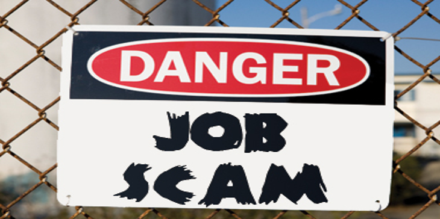
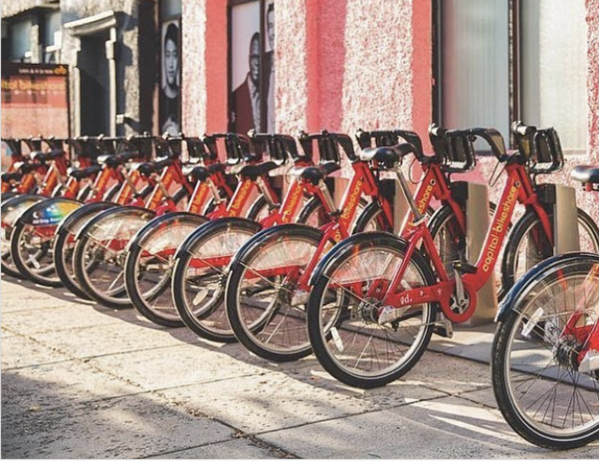

<!DOCTYPE html>
<html lang="en">
<head>
    <title>Portfolio for Tommy Jiang</title>
    <!-- Meta -->
    <meta charset="utf-8">
    <meta http-equiv="X-UA-Compatible" content="IE=edge">
    <meta name="viewport" content="width=device-width, initial-scale=1.0">
    <meta name="description" content="Portfolio for Tommy Jiang">
    <meta name="author" content="Portfolio for Tommy Jiang">    
    <link rel="shortcut icon" href="favicon.ico">  
    
    <link href='https://fonts.googleapis.com/css?family=Lato:300,400,300italic,400italic' rel='stylesheet' type='text/css'>
    <link href='https://fonts.googleapis.com/css?family=Montserrat:400,700' rel='stylesheet' type='text/css'> 
    
    <!-- FontAwesome JS -->
    
    
    <!-- Global CSS -->
    <link rel="stylesheet" href="assets/plugins/bootstrap/css/bootstrap.min.css">   
    
    <!-- github calendar css -->
    <link rel="stylesheet" href="assets/plugins/github-calendar/dist/github-calendar.css">
    <!-- github activity css -->    
    <link rel="stylesheet" href="//cdnjs.cloudflare.com/ajax/libs/octicons/2.0.2/octicons.min.css">
    <link rel="stylesheet" href="assets/plugins/github-activity/github-activity-0.1.5.min.css">
    
    <!-- Theme CSS -->  
    <link id="theme-style" rel="stylesheet" href="assets/css/styles.css">
    
</head> 

<body>
    <!-- ******HEADER****** --> 
    <header class="header">
        
                       
            
            

                <h1 class="name">Tommy Jiang</h1>
                <h2 class="desc">MS Analytics Student at Georgia Tech</h2>   
                <ul class="social list-inline">
                    <li class="list-inline-item"><a href="https://www.linkedin.com/in/tommyjiang01/" target="_blank"><i class="fab fa-linkedin-in"></i></a></li>
                    <li class="list-inline-item"><a href="https://github.com/TommyJiang91" target="_blank"><i class="fab fa-github"></i> </a></li>

                </ul> 
            
<!--//profile-->            
        
<!--//container-->
    </header><!--//header-->
    
    

        

            

                <section class="about section">
                    

                        <h2 class="heading">About Me22222</h2>
                        

                            
HELLO WORLD! My name is Tommy Jiang. I have 3 years of working experience in data analytics. I’m currently updating my knowledge and skills at the Georgia Tech MS in Analytics program. The new patch includes skills in analytics modeling, machine learning, deep learning, AI and NLP. The estimated completion date is December 2020. I look forward to applying my improved computational capability to solve business problems and create value for society.

                         
                        
<!--//content-->
                    
<!--//section-inner-->                 
                </section><!--//section-->
    
               <section class="latest section">
                    

                        <h2 class="heading">Data Science Projects</h2>
                        
    
                            

                            

                                <a class="col-md-4 col-12" href="#" target="_blank">
                                
                                </a>
                                

                                    <h3 class="title"><a href="#" target="_blank">Project 1</a></h3>
                                    
This is my project 1.

                                    
                                    	<a class="more-link" href="#" target="_blank"><i class="fas fa-external-link-alt"></i>Find out more</a>
                                    	<a class="more-link" href="#" target="_blank"><i class="fas fa-external-link-alt"></i>Find out more</a>
                                    	<a class="more-link" href="#" target="_blank"><i class="fas fa-external-link-alt"></i>Find out more</a>
                                    
                                
<!--//desc-->                          
                            
<!--//item-->
                            
                            

                                <a class="col-md-4 col-12" href="https://themes.3rdwavemedia.com/bootstrap-templates/resume/devcard-bootstrap-4-vcard-portfolio-template-for-software-developers/" target="_blank">
                                
                                </a>
                                

                                    <h3 class="title"><a href="https://themes.3rdwavemedia.com/bootstrap-templates/resume/devcard-bootstrap-4-vcard-portfolio-template-for-software-developers/" target="_blank">DevCard - Bootstrap 4 Portfolio Template for Software Developers</a></h3>
                                    
You can put one of your secondary projects here. Suspendisse in tellus dolor. Vivamus a tortor eu turpis pharetra consequat quis non metus. Aliquam aliquam, orci eu suscipit pellentesque, mauris dui tincidunt enim, eget iaculis ante dolor non turpis.

                                    
<a class="more-link" href="https://themes.3rdwavemedia.com/bootstrap-templates/resume/devcard-bootstrap-4-vcard-portfolio-template-for-software-developers/" target="_blank"><i class="fas fa-external-link-alt"></i>Find out more</a>

                                
<!--//desc-->                          
                            
<!--//item-->
                            
                             

                                <a class="col-md-4 col-12" href="https://tommyjiang91.github.io/Optimize_Bike_Sharing_System/" target="_blank">
                                
                                </a>
                                

                                    <h3 class="title"><a href="https://tommyjiang91.github.io/Optimize_Bike_Sharing_System/" target="_blank">Bikeshare Project</a></h3>
                                    
Bikeshare project description

                                    
                                    	<a class="more-link" href="#" target="_blank"><i class="fas fa-external-link-alt"></i>Find out more</a>
                                    	<a class="more-link" href="#" target="_blank"><i class="fas fa-external-link-alt"></i>Webpage</a>
                                    	<a class="more-link" href="#" target="_blank"><i class="fas fa-external-link-alt"></i>Github</a>
                                    

                                
<!--//desc-->                          
                            
<!--//item-->
                            
                            

                                <a class="col-md-4 col-12" href="https://themes.3rdwavemedia.com/bootstrap-templates/startup/bootstrap-template-for-mobile-apps-nova-pro/" target="_blank">
                                
                                </a>
                                

                                    <h3 class="title"><a href="https://themes.3rdwavemedia.com/bootstrap-templates/startup/bootstrap-template-for-mobile-apps-nova-pro/" target="_blank">Nova Pro - Bootstrap 4 Template for Mobile Startups</a></h3>
                                    
You can put one of your secondary projects here. Suspendisse in tellus dolor. Vivamus a tortor eu turpis pharetra consequat quis non metus.

                                    
<a class="more-link" href="https://themes.3rdwavemedia.com/bootstrap-templates/startup/bootstrap-template-for-mobile-apps-nova-pro/" target="_blank"><i class="fas fa-external-link-alt"></i>Find out more</a>

                                
<!--//desc-->                          
                            
<!--//item-->                            
                            

                                <a class="col-md-4 col-12" href="https://themes.3rdwavemedia.com/bootstrap-templates/startup/devstudio-bootstrap-theme-for-web-development-agencies-and-developers/" target="_blank">
                                
                                </a>
                                

                                    <h3 class="title"><a href="https://themes.3rdwavemedia.com/bootstrap-templates/startup/devstudio-bootstrap-theme-for-web-development-agencies-and-developers/" target="_blank">DevStudio - Bootstrap 4 Template for WebDev Agencies and Freelance Developers</a></h3>
                                    
 You can put one of your secondary projects here. Quisque rutrum. Aenean imperdiet. Etiam ultricies nisi vel augue. Curabitur ullamcorper ultricies nisi.

                                    
<a class="more-link" href="https://themes.3rdwavemedia.com/bootstrap-templates/startup/devstudio-bootstrap-theme-for-web-development-agencies-and-developers/" target="_blank"><i class="fas fa-external-link-alt"></i>Find out more</a>

                                
<!--//desc-->                          
                            
<!--//item-->
                            
                        
<!--//content-->  
                    
<!--//section-inner-->                
                </section><!--//section-->
                
                <section class="projects section">
                    

                        <h2 class="heading">Other Projects</h2>
                        

                            

                                <h3 class="title"><a href="https://themes.3rdwavemedia.com/bootstrap-templates/resume/free-bootstrap4-resume-cv-template-for-developers-pillar/" target="_blank">Pillar - Free Bootstrap 4 Resume/CV Template for Developers</a> Free</h3>
                                
Provide a brief description of your project. Ut enim ad minima veniam, quis nostrum exercitationem ullam corporis suscipit laboriosam, nisi ut aliquid ex ea commodi consequatu.

                                
<a class="more-link" href="https://themes.3rdwavemedia.com/bootstrap-templates/resume/free-bootstrap4-resume-cv-template-for-developers-pillar/" target="_blank"><i class="fas fa-external-link-alt"></i>Download Now</a>

                            
<!--//item-->
                            

                                <h3 class="title"><a href="https://themes.3rdwavemedia.com/bootstrap-templates/speciality/devblog-free-bootstrap-4-blog-template-for-developers/" target="_blank">DevBlog - Free Bootstrap 4 Blog Template for Developers</a> Free</h3>
                                
Provide a brief description of your project. Maecenas ornare ultricies risus, in fermentum augue consectetur in. Vestibulum vitae mauris iaculis, sollicitudin velit in, molestie nulla. 

                                
<a class="more-link" href="https://themes.3rdwavemedia.com/bootstrap-templates/speciality/devblog-free-bootstrap-4-blog-template-for-developers/" target="_blank"><i class="fas fa-external-link-alt"></i>Download Now</a>

                            
<!--//item-->
                           
                            
                            <a class="btn btn-cta-secondary" href="#">More on GitHub <i class="fas fa-chevron-right pt-1"></i></a>
                            
                        
<!--//content-->  
                    
<!--//section-inner-->                 
                </section><!--//section-->

            
<!--//primary-->
            

                 <aside class="info aside section">
                    

                        <h2 class="heading sr-only">Basic Information</h2>
                        

                            <ul class="list-unstyled">
                                <li><i class="fas fa-map-marker-alt"></i>Location:Atlanta, US</li>
                                <li><i class="fas fa-envelope"></i>Email:<a href="mailto:jjiang334@gatech.edu">jjiang334@gatech.edu</a></li>
                                <li><i class="fas fa-link"></i>Website:<a href="https://tommyjiang91.github.io/Portfolio_CV/">https://tommyjiang91.github.io/Portfolio_CV/</a></li>
                            </ul>
                        
<!--//content-->  
                    
<!--//section-inner-->                 
                </aside><!--//aside-->
                
                <aside class="skills aside section">
                    

                        <h2 class="heading">Programming Skill</h2>
                        
                   
                            

                               
                                

                                    <h3 class="level-title">Python<i class="fas fa-info-circle"></i></h3>
                                    

                                        

                                        
                                      
                                    
<!--//level-bar-->                                 
                                
<!--//item-->
                                
                                

                                    <h3 class="level-title">R<i class="fas fa-info-circle"></i></h3>
                                    

                                        

                                        
                                      
                                    
<!--//level-bar-->                                 
                                
<!--//item-->
                                
                                

                                    <h3 class="level-title">SQL</h3>
                                    

                                        

                                        
                                      
                                    
<!--//level-bar-->                                 
                                
<!--//item-->
                                
                                

                                    <h3 class="level-title">Tableau</h3>
                                    

                                        

                                        
                                      
                                    
<!--//level-bar-->                                 
                                
<!--//item-->

                                 

                                    <h3 class="level-title">D3.js</h3>
                                    

                                        

                                        
                                      
                                    
<!--//level-bar-->                                 
                                
<!--//item-->
                                
                                
<a class="more-link" href="https://github.com/TommyJiang91"><i class="fas fa-external-link-alt"></i>More on GitHub</a>
 
                            
              
                        
<!--//content-->  
                    
<!--//section-inner-->                 
                </aside><!--//section-->
                
                <aside class="education aside section">
                    

                        <h2 class="heading">Education</h2>
                        

                            
                      
                                <h3 class="title"><i class="fas fa-graduation-cap"></i> Master of Science in Analytics</h3>
                                <h4 class="university">Gerogia Institution of Technology (2019-2020)</h4>
                            
<!--//item-->
                            

                                <h3 class="title"><i class="fas fa-graduation-cap"></i> Master of Science in Finance</h3>
                                <h4 class="university">University of Illinois at Urbana-Champaign (2015-2016)</h4>
                            
<!--//item-->
                            

                                <h3 class="title"><i class="fas fa-graduation-cap"></i> Bachlor of Mathematics</h3>
                                <h4 class="university">University of Waterloo (2009-2014)</h4>
                            
<!--//item-->
                        
<!--//content-->
                    
<!--//section-inner-->
                </aside><!--//section-->
                           
                <aside class="education aside section">
                    

                        <h2 class="heading">Work Experience</h2>
                        

                            
                      
                                <h3 class="title"><i class="fas fa-briefcase"></i> Data Science Summer Intern</h3>
                                <h4 class="university">Wells Fargo (Summer 2020)</h4>
                            
<!--//item-->
                            
                      
                                <h3 class="title"><i class="fas fa-briefcase"></i> Forecast Team Supervisor</h3>
                                <h4 class="university">Hisense USA (October 2016-May 2019)</h4>
                            
<!--//item-->
                            
                      
                                <h3 class="title"><i class="fas fa-briefcase"></i> Sales Team Data Analyst</h3>
                                <h4 class="university">Hisense USA (October 2016-May 2019)</h4>
                            
<!--//item-->
                        
<!--//content-->
                    
<!--//section-inner-->
                </aside><!--//section-->

                <aside class="list music aside section">
                    

                        <h2 class="heading">Fields of Interest</h2>
                        

                            <ul class="list-unstyled">
                                <li><i class="fas fa-database"></i><a> Data Science</a></li>
                                <li><i class="fas fa-hand-holding-usd"></i><a>Finance</a></li>
                            </ul>
                        
<!--//content-->
                    
<!--//section-inner-->
                </aside><!--//section-->

                <aside class="list music aside section">
                    

                        <h2 class="heading">Hobbies</h2>
                        

                            <ul class="list-unstyled">
                                <li><i class="fas fa-hiking"></i><a> Camping</a></li>
                                <li><i class="fas fa-book-reader"></i><a>Reading</a></li>
                                <li><i class="fab fa-xbox"></i><a>Gaming</a></li>
                            </ul>
                        
<!--//content-->
                    
<!--//section-inner-->
                </aside><!--//section-->
                
                <aside class="list music aside section">
                    

                        <h2 class="heading">Favourite Coding Music</h2>
                        

                            <ul class="list-unstyled">
                                <li><i class="fas fa-headphones"></i> <a href="https://www.youtube.com/watch?v=fuUFrAVGYe4&t=1376s">John Wick Edition</a></li>
                                <li><i class="fas fa-headphones"></i> <a href="https://www.youtube.com/watch?v=ZzRnX4UNJso">Biohazard Edition</a></li>
                                <li><i class="fas fa-headphones"></i> <a href="https://www.youtube.com/watch?v=TQ9ZNwi9N6Y&t=336s">Encrypted AI</a></li>
                            </ul>
                        
<!--//content-->
                    
<!--//section-inner-->
                </aside><!--//section-->
                

              
            
<!--//secondary-->    
        
<!--//row-->
    
<!--//masonry-->
    
    <!-- ******FOOTER****** --> 
    <footer class="footer">
        

                <!--/* This template is free as long as you keep the attribution link below. Thank you for your support. :) If you'd like to use the template without the attribution, you can buy the commercial license via our website: themes.3rdwavemedia.com */-->
                <small class="copyright">Designed with <i class="fas fa-heart"></i> by <a href="https://themes.3rdwavemedia.com" target="_blank">Xiaoying Riley</a> for developers</small>
        
<!--//container-->
    </footer><!--//footer-->
 
    <!-- Javascript -->          
    
     
        
     
    <!-- github calendar plugin -->
    
    <!-- github activity plugin -->
    
    
    <!-- custom js -->
                
</body>
</html> 

